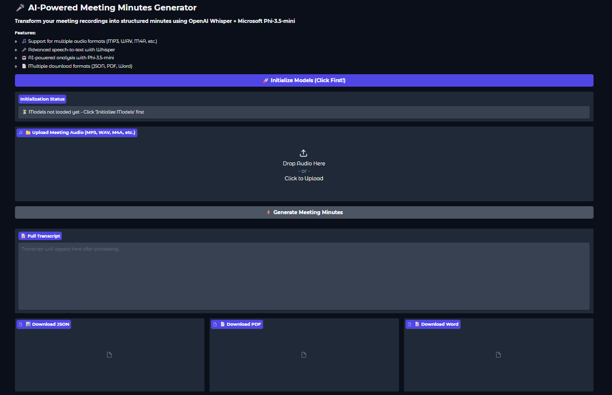
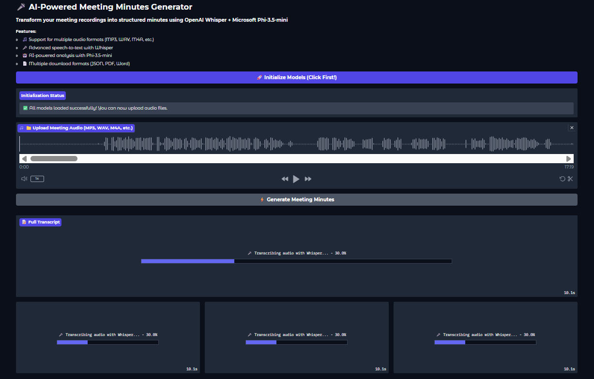
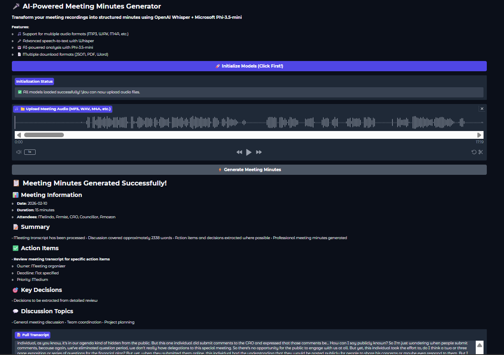
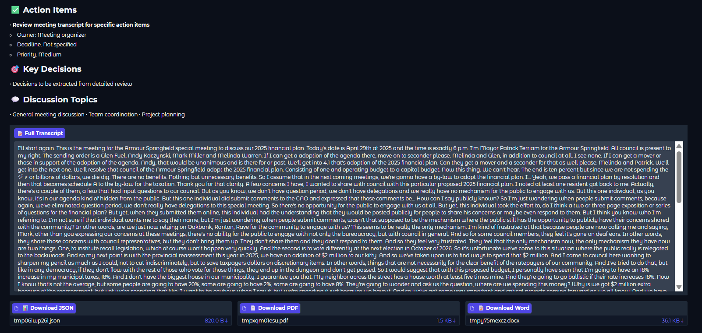

# 📝 AI-Powered Meeting Minutes Generator

Transform meeting recordings into structured, professional Meeting Minutes using OpenAI Whisper and Microsoft Phi-3.5-mini.

This project demonstrates an end-to-end Generative AI pipeline — from raw audio input to actionable meeting documentation in multiple export formats.

---

## 🚀 Key Features
- 🎙️ Supports multiple audio formats (MP3, WAV, M4A, etc.)
- 🧠 High-accuracy speech-to-text using OpenAI Whisper
- 🤖 AI-powered MoM generation using Phi-3.5-mini
- 📄 Automatically extracts
  - Meeting summary  
  - Action items  
  - Key decisions  
  - Discussion topics
- 📥 Download outputs in JSON, PDF, and Word
- ⚡ GPUCPU adaptive execution

---

## 🖥️ Application Walkthrough

### 1️⃣ User Interface
Clean and intuitive interface to initialize models and upload meeting audio.

---

### 2️⃣ Model Initialization & Audio Processing
After initializing models, the system processes uploaded audio and transcribes it using Whisper.

---

### 3️⃣ AI-Generated Meeting Minutes
Structured meeting minutes are generated automatically, including summary, action items, decisions, and topics.

---

### 4️⃣ Full Transcript & Downloadable Reports
Complete transcript and downloadable outputs in JSON, PDF, and Word formats.

---

## 🧠 System Architecture
1. Audio Input
2. Speech-to-Text (Whisper)
3. LLM-based MoM Generation (Phi-3.5-mini)
4. Structured Output & Document Export

---

## 🛠️ Technologies Used
- Python
- OpenAI Whisper
- Hugging Face Transformers
- Microsoft Phi-3.5-mini
- PyTorch
- FPDF
- Jupyter Notebook

---

## 📁 Project Structure
MOM_Generator
│── MOM_generator.ipynb
│── README.md
│── screenshots
│ ├── MOM1.png
│ ├── MOM2.png
│ ├── MOM3.png
│ └── MOM4.png

---

## 📌 Use Cases
- Corporate meeting documentation
- Remote team meetings
- Project planning & reviews
- Academic or research discussions

---

## 🔮 Future Enhancements
- Speaker diarization
- Multi-language support
- Web deployment (Streamlit  Gradio)
- Cloud-based inference

---

## 👤 Author
Shri

---

 This project showcases applied Generative AI skills, including speech processing, prompt engineering, LLM inference, and document automation.

